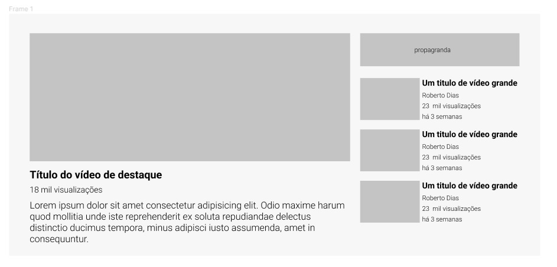
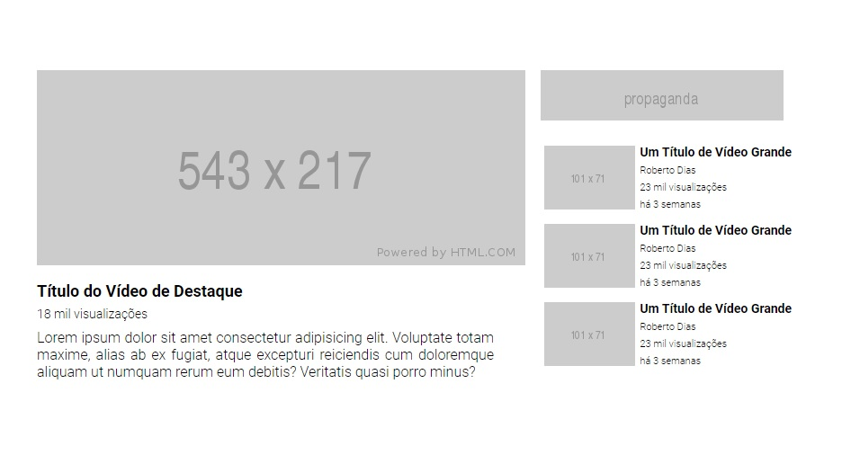

# README - Exercício Avançado CSS - FLEX e GRID -
Estudo de caso usando FLEX e GRID. no presente exercício tivemos que reproduzir um layout parecido com o layout do youtube. Usamos no projeto linguagem HTML e CSS. Nesse projeto não usamos a responsividade pois não foi apresentado no enúnciado do exercício o layout responsivo. 🚀🚀 

Abaixo está a imagem do layout que deveria ser reproduzido.

[]

Abaixo está a imagem do layout reproduzido por mim 

[]

## Tecnologias Utilizadas
- HTML
- CSS

## Dificuldades Enfrentadas
- Por ser o primeiro desenvolvimento feito por mim que envolvesse FLEX e GRID fique um pouco perdido no começo, mas após pesquisar na internet e rever algumas aulas de alguns cursos feitos, consegui reproduzir bem o que foi pedido.
